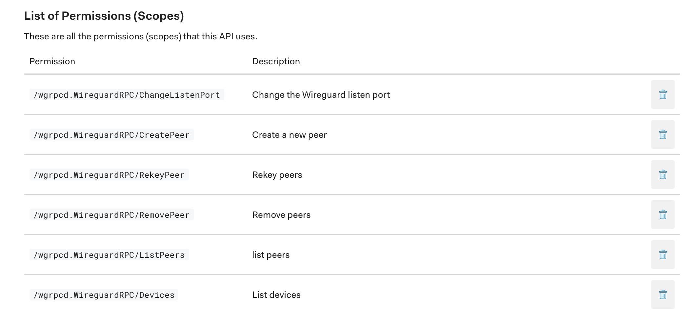
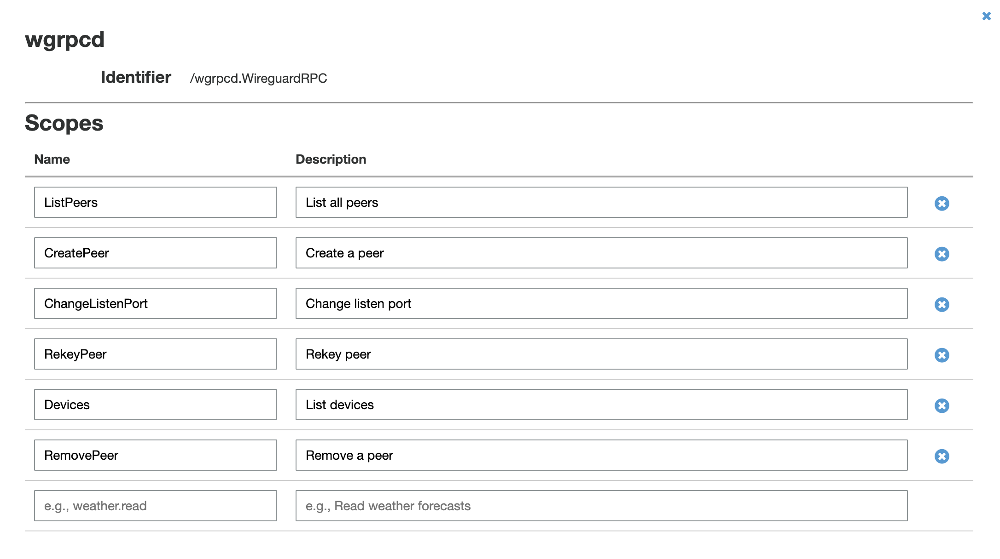
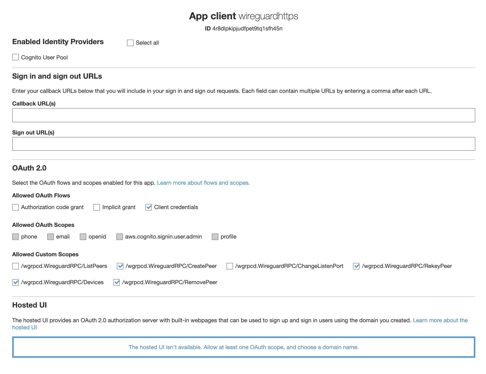

# Wireguard Controller

[](https://godoc.org/github.com/joncooperworks/wgrpcd)

## Warning
`wgrpcd` has not been audited and is not suitable for production workloads.
It's still under heavy development and is a hobby project to be used with [targetpractice.network](https://targetpractice.network), [wireguardhttps](https://github.com/joncooperworks/wireguardhttps) and other projects I develop in my spare time.
Reach out to me on [Twitter](https://twitter.com/joncooperworks) if you're interested in using `wgrpcd` in production.

## Overview
`wgrpcd` controls a Wireguard instance, exposing operations over a gRPC API.
This process must run with permissions to manipulate Wireguard interfaces and as such is bound to localhost by default, but can be publicly exposed to let an application control `wgrpcd` from a different server.
No matter where it's bound, it must be configured to use [mTLS](https://developers.cloudflare.com/access/service-auth/mtls) with TLSv1.3.
Keep all CA key material in a safe place, like [Azure Key Vault](https://azure.microsoft.com/en-us/services/key-vault/).
You can use [certstrap](https://github.com/square/certstrap) to create certificates.
This gRPC API is meant to be called by a lower privileged application that can provide services on top of Wireguard that interact with the general internet.
It intentionally exposes minimal functionality to limit the attack surface.
Clients have no good reason to retrieve a private key once it has been created.
They should instead generate a new private key if they ever need a new configuration and revoke the old key.

```
Usage of wgrpcd:
  -ca-cert string
        -ca-cert is the CA that client certificates will be signed with. (default "cacert.pem")
  -cert-filename string
        -cert-filename server's SSL certificate. (default "servercert.pem")
  -key-filename string
        -key-filename is the server's SSL key. (default "serverkey.pem")
  -listen-address string
        -listen-address specifies the host:port pair to listen on. (default "localhost:15002")
  -openid-api-identifier string
        -openid-api-identifier is the API identifier given by the OpenID provider when setting up a machine-to-machine app.
  -openid-domain string
        -openid-domain is the domain the OpenID provider gives when setting up a machine-to-machine app.
  -openid-provider string
        -openid-provider enables OAuth2 authentication of clients using an OpenID provider's machine-to-machine auth. Allowed: (aws, auth0)
```

`wgrpcd` doesn't maintain any state to limit attack surface.
This means `wgrpcd` does not:
+ Allocate IP Addresses
+ Set DNS providers for clients
+ Limit access between connected devices
+ Monitor VPN traffic

If you need these, you'll need to build it yourself.
You can look at [wireguardhttps](https://github.com/joncooperworks/wireguardhttps) as an example of how to build some of those things on top of `wgrpcd`.

## Running without root
You can run this program on Linux without root by setting the `CAP_NET_ADMIN` and `CAP_NET_BIND_SERVICE` capabilities on the `wgrpcd` binary.
Set them using `sudo setcap CAP_NET_BIND_SERVICE,CAP_NET_ADMIN+eip wgrpcd`

## API Operations
+ Create peer and get provisioned config (one operation to minimize the time the private key is in memory)
+ Regenerate peer config and revoke old private key 
+ Remove peer and revoke old private key
+ Change wireguard listen port
+ View registered peers

## Authentication
`wgrpcd` uses mTLS to limit access to the gRPC API.
Unencrypted connections will be rejected.
Client certificates must be signed by the Certificate Authority passed with the `-ca-cert` flag.

### auth0
`wgrcpd` also supports optional OAuth2 using [auth0](https://auth0.com/)'s [Machine to Machine](https://auth0.com/machine-to-machine) offering.
I recommend using it if you will be running `wgrpcd` on a separate host from its client(s).
I use it to put `wgrpcd` clients on Heroku while being able to revoke access and maintain better audit logs of access to `wgrpcd`.
Pass `auth0` to the `-openid-provider` flag to enable auth0 and pass your auth0 [Domain and API Identifier](https://auth0.com/docs/get-started/set-up-apis) with the `-openid-domain` and `-openid-api-identifier` flags.

In order to access the methods on the gRPC API, you'll have to add scopes to auth0.
You can copy them from the [Permissions](#permissions) section below.



### AWS Cognito
Pass `aws` to the `-openid-provider` flag to enable auth0 and pass your AWS Cognito Domain and API Identifier with the `-openid-domain` and `-openid-api-identifier` flags.
`wgrpcd` supports [AWS Cognito](https://aws.amazon.com/cognito/) as an Open ID Provider.
`wgrpcd` clients must be added as an [App Client](https://docs.aws.amazon.com/cognito/latest/developerguide/user-pool-settings-client-apps.html) using the Client Credentials grant type in Cognito.
In order to access the methods on `wgrpcd`, you need to register the permissions as scopes in AWS Cognito.
AWS Cognito sends scopes in the format `API identifier/scope name`. 
`wgrpcd`'s identifer should be `/wgrpcd.WireguardRPC`, and the scopes should be named after the individual methods, like `CreatePeer` and `RekeyPeer`.
You can copy the scopes from the [Permissions](#permissions) section below.




### Permissions
`wgrpcd` clients authenticated with auth0 will only be able to access the gRPC method names specified as OAuth2 scopes.
On AWS, this means your API Identifier must be `/wgrpcd.WireguardRPC`, and the scope should be named after the method name, like `CreatePeer`.


```
// Permissions allow wgrpcd to limit access to methods on its gRPC server based on configuration with an OpenID provider.
// The permissions in this file are meant to allow admins to limit access to wgrpcd functions.
// These permissions should be passed as scopes in the JWT from the OpenID provider.
const (
	// PermissionChangeListenPort allows a client to change the Wireguard VPN's listening port
	PermissionChangeListenPort = "/wgrpcd.WireguardRPC/ChangeListenPort"

	// PermissionCreatePeer allows a client to create a new peer on the Wiregurd interface.
	PermissionCreatePeer = "/wgrpcd.WireguardRPC/CreatePeer"

	// PermissionRekeyPeer allows a client to rekey a peer.
	PermissionRekeyPeer = "/wgrpcd.WireguardRPC/RekeyPeer"

	// PermissionRemovePeer allows a client to remove a peer from the interface.
	PermissionRemovePeer = "/wgrpcd.WireguardRPC/RemovePeer"

	// PermissionListPeers allows a client to list active peers.
	PermissionListPeers = "/wgrpcd.WireguardRPC/ListPeers"

	// PermissionListDevices allows a client to list active Wireguard interfaces on a host.
	PermissionListDevices = "/wgrpcd.WireguardRPC/Devices"
)
```

Clients should only request the permissions they need to limit the impact of compromised credentials.
For example, WireguardHTTPS has no reason to change the listen port of a Wireguard VPN.



### Custom Auth Schemes
You can add support for custom auth schemes using the [AuthProvider](https://godoc.org/github.com/JonCooperWorks/wgrpcd#AuthProvider) function type if you use `wgrpcd` as a library with a new driver program.
See [wgrpcd.go](wgrpcd.go) and [auth0.go](auth0.go) for an example of how to do that.

```
// AuthProvider validates a gRPC request's metadata based on some arbitrary criteria.
// It's meant to allow integration with a custom auth scheme.
// Implementations return error if authentication failed.
type AuthProvider func(md metadata.MD) (*AuthResult, error)
```

Once you've created an AuthProvider implementing the authentication scheme, pass it in a [ServerConfig](https://godoc.org/github.com/JonCooperWorks/wgrpcd#ServerConfig) to [NewServer](https://godoc.org/github.com/JonCooperWorks/wgrpcd#NewServer) and serve it like a regular gRPC server.

```
//ServerConfig contains all information a caller needs to create a new wgrpcd.Server.
type ServerConfig struct {
	TLSConfig      *tls.Config
	CACertFilename string
	AuthProvider   AuthProvider
	Logger         Logger
}
```


## Using the API
```wgrpcd``` exposes a gRPC server that controls a Wireguard interfaces.
By default, it listens on ```localhost:15002```.
It can be connected to with any language, but this RPC server is intended to be used by [wireguardhttps](https://github.com/joncooperworks/wireguardhttps).
The protobuf service, requests and responses can be found in [wgrpcd.proto](wgrpcd.proto).

This package exports an API client that handles gRPC connections and handles input validation.


There's a [wgrpcd.Client](https://godoc.org/github.com/JonCooperWorks/wgrpcd#Client) that handles loading SSL credentials and performs some input validation before sending it over the wire in [client.go](client.go).

To create a client, pass a [wgrpcd.ClientConfig](https://godoc.org/github.com/JonCooperWorks/wgrpcd#ClientConfig) struct to [wgrpcd.NewClient](https://godoc.org/github.com/JonCooperWorks/wgrpcd#NewClient). 
You can use [wgrpcd.AWSCognitoClientCredentials](https://godoc.org/github.com/JonCooperWorks/wgrpcd#AWSCognitoClientCredentials) or [wgrpcd.Auth0ClientCredentials](https://godoc.org/github.com/JonCooperWorks/wgrpcd#Auth0ClientCredentials) to generate a `grpc.DialOption` that conects to an OAuth2 provider.

```
// ClientConfig contains all information needed to configure a wgrpcd.Client.
// Client authentication can be configured using the Options []DialOption.
type ClientConfig struct {
	GRPCAddress     string
	ClientCertBytes []byte
	ClientKeyBytes  []byte
	CACertFilename  string
	Options         []grpc.DialOption
}
```

Client certificates are represented as byte slices, making it easy to load from environment variables.
This makes it possible to do `git push heroku master` with `wgprcd` clients without putting your client credentials in version control.


Go clients of `wgrpcd` should use [wgrpcd.Client](https://godoc.org/github.com/JonCooperWorks/wgrpcd#Client) instead of writing their own client implementations.
If you spot an improvement, please submit a pull request.

There's an example client in [wg-info.go](wg-info.go) that displays all connected Wireguard interfaces.
The client needs to be configured for mTLS with a client certificate, key and CA certificate for validating the server.

```
Usage of wg-info:
  -audience string
        -audience is the auth0 audience
  -ca-cert string
        -ca-cert is the CA that server certificates will be signed with. (default "cacert.pem")
  -client-cert string
        -client-cert is the client SSL certificate. (default "clientcert.pem")
  -client-id string
        -client-id is the oauth2 client id
  -client-key string
        -client-key is the client SSL key. (default "clientkey.pem")
  -client-secret string
        -client-secret is the oauth2 client secret
  -openid-provider string
        -openid-provider specifies the OpenID provider to use. Supported: ('aws', 'auth0')
  -token-url string
        -token-url is the oauth2 client credentials token URL
  -wgrpcd-address string
        -wgrpcd-address is the wgrpcd gRPC server on localhost. It must be running to run this program. (default "localhost:15002")
  -wireguard-interface string
        -wireguard-interface is the name of the wireguard interface. (default "wg0")